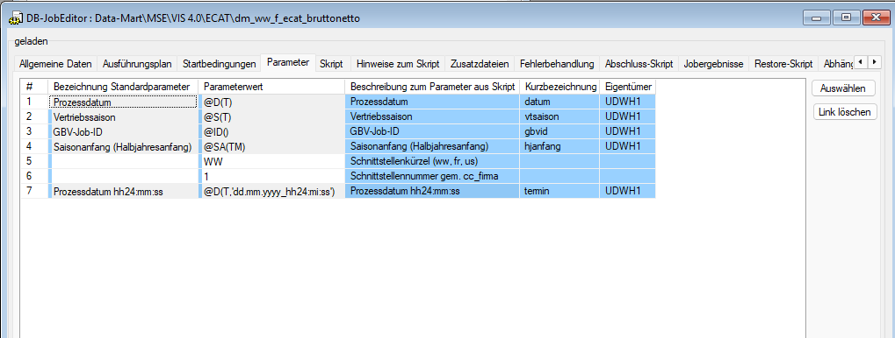

# dm_f_ecat – Migration Sample (Oracle DSV Job)

<aside>
🧭

**Zweck dieser Sample-Seite:** Vorlage zur Analyse und Migration eines Oracle DSV/GBV Jobs nach Databricks/LDV.

**Prinzip:** Erst *Orchestrierung + Gates + Lineage + Idempotenz* verstehen, dann erst Ziel-Implementierung ableiten.

</aside>

### 0) Steckbrief (auszufüllen)

- **Jobname (DSV):** `dm_f_ecat`
- **System / Domäne:** eCAT / CC
- **Quellsystem(e):** Oracle DWH (UDWH/PAPA/IMDB)
- **Zielobjekte (Oracle heute):** `dm_f_ecat_brutto`, `dm_f_ecat_netto`, `dm_f_ecat_kwkum_brutto`, `dm_f_ecat_kwkum_netto`
- **Frequenz:** (täglich / nach Bedarf)
- **Run-ID / Load-ID:** `&gbvid` (wird als `dwh_cr_load_id` in Stages verwendet)
- **Parameter:** `&datum`, `&vtsaison`, `&hjanfang`, `&termin`, `&5` (Schnittstellenkürzel), `&6` (SST)
- **Artefakte:** Screenshot(s), Parameter-Screenshot, Script Header, Abhängigkeits-Export

---

### 1) Technologie-Stack (heute)

- **Orchestrierung:** DSV / GBV (Job-Scheduling + Startbedingungen)
- **Runner:** Oracle SQL*Plus (PROMPT, `&`-Substitution, `EXEC`, PL/SQL-Blocks via `/`)
- **Transform:** Oracle SQL + PL/SQL
- **DWH-Framework:** `PKG_IM_LADUNG`, `PKG_IM_PARTITION`, `PKG_STATS`
- **Besonderheiten:**
    - DSV ersetzt `@…` Platzhalter *vor* der Ausführung (Preprozessor)
    - Performance-Pattern: `APPEND`, `PARALLEL DML`, `GATHERTABLE`, viele Commits
    - DB-Link Nutzung: `@DBL_LOADER()` (Loadhistory aus anderem Kontext)

---

### 2) Startbedingungen / Gates (Orchestrierungslogik)

> Ziel: harte Abhängigkeiten und Lauf-Exklusivität erfassen (DAG-Kanten, Concurrency-Regeln).
> 

**Gate A — Exklusivität / kein paralleler Lauf**

```sql
SELECT DECODE(COUNT(*), 0 , 1, NULL)
   FROM GBV_BATCH_JOB
 WHERE BAJ_PROJEKT = 'DSV'
   AND BAJ_IPAR_1 = @JB()
   AND ( BAJ_STATUS = 'B'
         OR (     BAJ_STATUS = 'N'
             AND  BAJ_TERMIN < @D(T,'dd.mm.yyyy hh24:mi:ss')
            )
       )
```

**Gate B — LV-Tag + Vorlauf CC_WW_BUCHUNG ok (Loadhistory + Rows>0)**

```sql
SELECT CASE WHEN lv = 0 THEN 1 ELSE buch END
  FROM (SELECT COUNT (*) AS lv
          FROM cc_fakturakalenderlv
          WHERE dwh_valid_to = TO_DATE('31.12.9999', 'dd.mm.yyyy')
          AND lvdat = @D(T) ) lvinfo,
       (SELECT CASE WHEN COUNT (*) = 1 THEN 1 ELSE NULL END AS buch
          FROM udwh_loadhistory
         WHERE dwh_destination = 'CC'
            AND dwh_process = 'CC_WW_BUCHUNG' 
            AND TRUNC (dwh_processdate) = @D(T)
            AND dwh_runnumber = 1 
            AND dwh_noofrows > 0) lh
```

**Gate C — LV-Tag + Vorlauf CC_WW_KUNDE ok (Loadhistory via DB-Link)**

```sql
SELECT CASE WHEN lv = 0 THEN 1 ELSE stamm END
  FROM (SELECT COUNT (*) AS lv
          FROM cc_fakturakalenderlv
          WHERE dwh_valid_to = TO_DATE('31.12.9999', 'dd.mm.yyyy')
          AND lvdat = @D(T) ) lvinfo,
       (SELECT CASE WHEN COUNT (*) = 1 THEN 1 ELSE NULL END AS stamm
          FROM udwh_dh.udwh_loadhistory@DBL_LOADER()
              WHERE dwh_destination = 'CC'
              AND dwh_process = 'CC_WW_KUNDE'
              AND TRUNC(dwh_processdate) = @D(T)
              AND dwh_runnumber = 1
              AND dwh_noofrows > 0) lh
```

**Offen / unvollständig (aus Original):**

```sql
select case when count(*) < 1 then 1 else null end
from gbv_batch_job
where baj_projekt = 'DSV'
and baj_status = 'B'
and baj_ipar_4 = 
```

---

### 3) Datenfluss (high level)

> Ziel: aus einem Script schnell ein reproduzierbares, migrationstaugliches Bild machen.
> 
- **Hauptquellen:** `cc_buchung`, `cc_kunde_&vtsaison`, `cc_snow_attribution`, diverse Dimensions-/Mappingtabellen
- **Staging-Kette:** `cldm_&5._f_ecat_1..7` + `cldm_&5._f_ecat_brutto/_netto` + `cldm_&5._f_ecat_kwkum_*`
- **Ziele:** `dm_f_ecat_brutto/_netto` (granular) + `dm_f_ecat_kwkum_*` (Wochenaggregation)

```mermaid
flowchart TD
  A[GBV/DSV Jobstart] --> B[DSV Preprozessor \n ersetzt @-Platzhalter]
  B --> C[SQL*Plus Script]

  C --> G1[Gate: Exklusivität \n GBV_BATCH_JOB]
  G1 --> G2[Gate: LV-Tag + Loadhistory \n CC_WW_BUCHUNG ok]
  G2 --> G3[Gate: LV-Tag + Loadhistory \n CC_WW_KUNDE ok (DB-Link)]

  G3 --> S0[TRUNCATE cldm_&5._f_ecat_*]
  S0 --> S1[_1 Auftragskennzahlen]
  S1 --> S2[_2 Kundendaten]
  S2 --> S3[_3 Buchungsdaten]
  S3 --> S5[_5 Attributionen]
  S5 --> S6[_6 Join/Berechnung]
  S6 --> S3b[_3 Attributionen hinzuspielen]
  S3b --> S7[_7 Gruppierung]
  S7 --> S4[_4 Positions-Counts]
  S4 --> SB[Stage Brutto/Netto]
  SB --> SA[Stage Wochen-Aggregate]

  SA --> L1[Partition mgmt + Subpartition truncate]
  L1 --> L2[Load via PKG_IM_LADUNG]
  L2 --> L3[Loadhistory]
```

---

### 4) Idempotenz & Ladeverhalten (entscheidend für Migration)

> Ziel: festhalten, *wie* ein Re-Run wirkt.
> 
- **Staging:** wird immer per `TRUNCATE` komplett geleert.
- **Zieltabellen:**
    - Partitionen werden bei Bedarf angelegt.
    - Danach werden Subpartitionen für (Monat, Firmabez) bzw. (Wittwoche, Firmabez) getruncatet.
    - Dann wird geladen.

**Ableitung:** Das Oracle-Pattern ist *idempotent durch truncate+reload* (nicht durch Merge).

---

### 5) Migrations-Notizen (erstmal nur Leitplanken)

> Noch keine Zielarchitektur festlegen. Nur festhalten, was für die spätere Umsetzung gebraucht wird.
> 
- **Workflow/DAG:** Gates werden später zu Task-Dependencies und Concurrency-Regeln.
- **Run-ID:** `&gbvid` eignet sich als `run_id` für Audit/Lineage.
- **Overwrite-Strategie:** entspricht in Lakehouse-Welt häufig „overwrite by partition“ (z.B. Monat+Firma) oder kontrolliertes Replace einer Slice.
- **Offene Punkte für spätere Klärung:**
    - Welche Partitionierungslogik ist im Ziel sinnvoll (Delta Partitioning vs. Liquid Clustering)?
    - Welche Tabellen sind wirklich „Source of Truth“ für Dimensionen/Mappings?
    - Was ist die fachliche Definition von Brutto/Netto im Ziel und wie wird sie validiert?

---

### 6) Rohmaterial (Original, als Referenz)

- Parameter-Screenshot
    
    
    
    Parameter
    
- Header / Script-Auszug (Original)
    
    ```sql
    /*******************************************************************************
    
    Job:              dm_f_ecat
    Beschreibung:     Skript erstellt die Daten für das ECAT Modul
    
    verwendete Tabellen:  CC_KUNDE
                          CC_BUCHUNG
    
    Endtabellen:          DM_F_ECAT
    Fehler-Doku:      https://confluence.witt-gruppe.eu/display/IM/eCAT
    
    ... (siehe Original unten aufklappen falls benötigt)
    *******************************************************************************/
    ```
    
- Komplettes Original-Skript (unverändert, aus DSV exportiert)
    
    ```sql
    PROMPT =========================================================================
    PROMPT Parameter
    PROMPT Prozessdatum: &datum  
    PROMPT VT-Saison: &vtsaison
    PROMPT GBV-ID: &gbvid
    PROMPT Halbjahresanfang: &hjanfang
    PROMPT Prozesstermin: &termin
    PROMPT Schnittstellenkürzel: &5
    PROMPT Schnittstellennummer: &6
    PROMPT =========================================================================
    
    ALTER SESSION ENABLE PARALLEL DML;
    
    PROMPT ======================================
    PROMPT 1. Leeren der Temporärtabellen
    PROMPT ======================================
    
    TRUNCATE TABLE cldm_&5._f_ecat_brutto;
    TRUNCATE TABLE cldm_&5._f_ecat_netto;
    TRUNCATE TABLE cldm_&5._f_ecat_1;
    TRUNCATE TABLE cldm_&5._f_ecat_2;
    TRUNCATE TABLE cldm_&5._f_ecat_3;
    TRUNCATE TABLE cldm_&5._f_ecat_4;
    TRUNCATE TABLE cldm_&5._f_ecat_5;
    TRUNCATE TABLE cldm_&5._f_ecat_6;
    TRUNCATE TABLE cldm_&5._f_ecat_7;
    TRUNCATE TABLE cldm_&5._f_ecat_kwkum_brutto;
    TRUNCATE TABLE cldm_&5._f_ecat_kwkum_netto;
    
    -- (Rest siehe vorherige Version der Seite; bei Bedarf wieder hier vollständig einfügen)
    ```
    
- Abschluss-Skript (Original)
    
    ```sql
    DECLARE
      v_noofrows      PLS_INTEGER;
      v_wittwocheid   PLS_INTEGER;
      CURSOR datencursor IS
      SELECT DISTINCT firmabez, TRUNC(buchdatnr/100)*100+1 as buchdat FROM cldm_&5._f_ecat_brutto;
      CURSOR aggdatencursor IS
      SELECT DISTINCT firmabez, wittwochenr FROM cldm_&5._f_ecat_kwkum_brutto;
    BEGIN
      DBMS_OUTPUT.PUT_LINE ('DSV-Fehlervariable:' || :DSVFehler);
      IF (:DSVFehler IN ('00000','00010'))  THEN
        PKG_IM_PARTITION.P_ADD_RANGEPARTITION ('dm_f_ecat_brutto', TO_CHAR(TRUNC(&datum, 'MONTH'), 'YYYYMM'), TO_NUMBER(TO_CHAR(ADD_MONTHS (TRUNC(&datum, 'MONTH'),1),'YYYYMMDD')));
        PKG_IM_PARTITION.P_ADD_RANGEPARTITION ('dm_f_ecat_netto', TO_CHAR(TRUNC(&datum, 'MONTH'), 'YYYYMM'), TO_NUMBER(TO_CHAR(ADD_MONTHS (TRUNC(&datum, 'MONTH'),1),'YYYYMMDD')));
        FOR c1 IN datencursor LOOP
          EXECUTE IMMEDIATE 'ALTER TABLE dm_f_ecat_brutto TRUNCATE SUBPARTITION FOR ('||c1.buchdat||', '''||c1.firmabez||''')';
          EXECUTE IMMEDIATE 'ALTER TABLE dm_f_ecat_netto TRUNCATE SUBPARTITION FOR ('||c1.buchdat||', '''||c1.firmabez||''')';
        END LOOP;
        PKG_IM_LADUNG.P_LADUNG_BEW ('dm_f_ecat_brutto', :DSV_ABSCHLUSS_ID, 'cldm_&5._f_ecat_brutto');
        PKG_IM_LADUNG.P_LADUNG_BEW ('dm_f_ecat_netto', :DSV_ABSCHLUSS_ID, 'cldm_&5._f_ecat_netto');
        SELECT witt_woche_id INTO v_wittwocheid
        FROM cc_kalender
        WHERE tag_datum = &datum;
        PKG_IM_PARTITION.P_ADD_LISTPARTITION ('dm_f_ecat_kwkum_brutto', v_wittwocheid, '', 'WITTWONR');
        PKG_IM_PARTITION.P_ADD_LISTPARTITION ('dm_f_ecat_kwkum_netto', v_wittwocheid, '', 'WITTWONR');
        FOR c2 IN aggdatencursor LOOP
          EXECUTE IMMEDIATE 'ALTER TABLE dm_f_ecat_kwkum_brutto TRUNCATE SUBPARTITION FOR ('||c2.wittwochenr||', '''||c2.firmabez||''')';
          EXECUTE IMMEDIATE 'ALTER TABLE dm_f_ecat_kwkum_netto TRUNCATE SUBPARTITION FOR ('||c2.wittwochenr||', '''||c2.firmabez||''')';
        END LOOP;
        PKG_IM_LADUNG.P_LADUNG_BEW ('dm_f_ecat_kwkum_brutto', :DSV_ABSCHLUSS_ID, 'cldm_&5._f_ecat_kwkum_brutto');
        PKG_IM_LADUNG.P_LADUNG_BEW ('dm_f_ecat_kwkum_netto', :DSV_ABSCHLUSS_ID, 'cldm_&5._f_ecat_kwkum_netto');
        PKG_IM_LADUNG.P_LOADHISTORY (:DSV_ABSCHLUSS_ID);
      END IF;
    END;
    /
    ```
    
- Screenshot: Abhängigkeiten (ungepflegt)
    
    
    
- Screenshot: DSV Job (GUI)
    
    